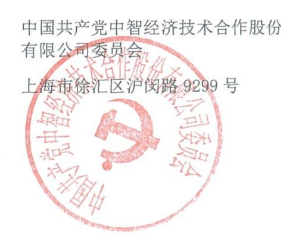

# cic guan αitong

中国共产党中智经济技术合作股份有限公司委员会

与

中智关爱通（上海）科技股份有限公司

## 关爱通软件服务协议

2023年版

<table><tr><td rowspan="2">专业服务协议</td><td></td></tr><tr><td>关爱通软件服务协议</td></tr><tr><td>cic</td><td>第1页</td></tr></table>

甲 ：中国共产党中智经济技术合作股份有限公司党委会 （以下简称“甲方”)乙 ：中智关爱通（上海）科技股份有限公司 （以下简称“乙”)

### 1.总则

“红客厅”企业版是一款可视化的党建宣传展示平台，旨在辅助企业将党建公司做“组织行为可视化、组织活动规范化、组织档案电化、优秀案例共享化、历史成绩清晰化”。本协议约定之平台服务是乙方基于自身在技术、行业生态和运营保障方面的优势，为客户提供党建宣传展示的数字多媒体技术解决方案，系自主研发的一体化运营管理服务集合平台。乙方通过体系搭建、基础数据管理、内容管理、文档管理、集成服务、拓展功能定制等平台集合服务，以SaaS平台模式交付，帮助客户构建专属的党建宣传系统，顺利推动党建是数字化转型。

双本着“互惠合作、平等互利、共同发展”的原则，经双友好协商达成本协议。

### 2.服务内容

2.1软件使用

（1）为便于甲进内容管理，乙提供相应的各级管理账户。  
（2）“红客厅”企业版，包含但不仅限于“我们是党员”“新征程”“民红”“照墙”“朋友圈”等服务模块。甲可根据实际所需定义增减模块。  
（3）乙方可提供为期一个月的平台试用服务，后续平台服务履约以试用期间所提供的服务和功能为依据。

2.2技术服务

乙方同意在本合同规定的期限内按照合同的规定，向甲方提供系统维护和支持服务。乙方应及时对甲的相关人员进行培训，培训目标为受训者能够独、熟练地完成操作，实现依据本合同所规定的软件的目标和功能。

2.3增值服务（可选服务，不作为必选要求）

<table><tr><td rowspan="2">专业服务协议</td><td></td></tr><tr><td>关爱通软件服务协议</td></tr><tr><td>cic</td><td>第2页</td></tr></table>

乙方根据产品发展、市场需求和资源配套服务能力，不定期优化整合符合党建工作相关的各项增值服务。增值服务标准另行商议。

2.4甲方同意乙方的具体服务具有一定时间和形式上的弹性。双方协商达成共识后，可通过书面形式对工作内容或服务时间约定进行变更。

### 3.费用收取

3.1在本合同期限内，按照双方约定，甲方向乙方支付如下费用：

（1）年服务（标准版）

“红客厅”企业版初次使用为首年服务，服务协议经双方盖章确认后，5个工作日内由甲方向乙次性付费。乙向甲开具内容为“技术服务费”的增值税发票。

（2）续约次年服务（标准版）“红客厅”企业版次年续用为续约次年服务，续约服务协议经双盖章确认后，5个作内由甲方向乙方一次性支付费用。乙方向甲方开具内容为“软件使用费”的增值税发票。

3.2甲方可通过银行转账的方式将相应款项支付至乙方指定收款账户：

公司名称： 中智关爱通（上海）科技股份有限公司  
银行账号： 121910658210606  
开户银行： 招商银行天钥桥支行

3.3甲乙双自行承担相应税费。乙方向甲方开具合法有效发票。甲方应向乙方提供开票信息，如乙方开具为电子发票的，则电子发票发送到甲方指定联系人的邮箱，甲方可自行下载并打印。根据税务局对发票的相关规定，合法有效的电子发票可作为正式的会计凭证入账。电子发票一经开具，除乙方开票错误原因外，不得变更。

3.4甲乙双方经友好协商，甲方首年开设若干账户试用，服务期限为2023年9月-2024年8月。费用为总计49000元（肆万玖仟元整）

### 4.乙方责任

4.1.乙方负责在协议生效后，根据双方书面约定的合理的时间内向甲方交付平台系统，并完成平台的初始配置，并提供配套服务支持；

<table><tr><td rowspan="2">专业服务协议</td><td></td></tr><tr><td>关爱通软件服务协议</td></tr><tr><td>cic</td><td>第3页</td></tr></table>

4.2.乙方严格保护甲方数据的安全；乙方随时保持甲方使用应用的功能正确和高效性能，及时修正Bug和提使用效率；

4.3.乙方负责提供系统使用手册等相关资料供甲方及甲方员工便捷使用平台系统；

4.4.乙方负责平台的日常维护与升级；

4.5.乙方向甲方按时提供符合本协议及协议附件、补充协议中约定的服务；无论所约定的服务由乙方直接或者间接提供，乙方均保证各项配套的服务、提供的物品、资料均符合本协议约定；

4.6.乙方指派专人同甲方进行联系，及时解决甲方在合作过程中遇到的问题；

4.7．双约定一致的其他相关性服务内容。

### 5.甲方义务

5.1．甲方及时提供明确且合理的业务需求，配合乙方完成合作项目的设定；

5.2.甲方应安排专人配合乙方开展工作，及时协调与员工和企业相关部门的沟通，甲方指定联系，姓名【杨梦妮】电话 $[ 0 2 1 - 5 4 5 9 4 5 4 5 ^ { * } 5 7 5 9 ]$ 邮箱【yangmn@ciicsh.com】以便乙方安全移交服务凭证及发送发票等事宜；

5.3.如涉及服务费用，甲方应在本协议生效后，在双方书面约定一致的时间内，按本协议及协议附件、补充协议中的相关约定，及时向乙支付相关费用；

5.4.甲应按照乙方操作流程实施相关项目；

5.5.确保平台上甲方的所有信息均真实有效；

5.6.双约定一致的其他相关性内容。

### 6.知识产权

6.1.双方同意，根据本协议条款，在甲方最终付清全部款额后，乙方向甲方授予免收使用费、非专有、不可转让、在内部使用的许可。甲方有权持有并在授权的范围内使用平台，但不得任意转让和许可他人使。

6.2.本协议的任何约定，均不应视为允许甲方在未经乙方事先书面同意的情况下，向其子公司、关联公司或第三方披露、让其接触、分许可、反汇编、反编译、反向工程、修改或转让乙方的任何资料。

<table><tr><td rowspan="2">专业服务协议</td><td></td></tr><tr><td>关爱通软件服务协议</td></tr><tr><td>cic</td><td>第4页</td></tr></table>

甲方负责提供开通平台的必要信息，包括但不限于企业名称、网址自定义字段、企业联系人的信息、视觉档（Logo，页图）等；甲提供的资料和信息及相关知识产权仍归甲所有。

### 7.保密条款

7.1.保密信息指在本协议签订过程中和履行服务期间，甲乙双方相互间获得的具有商业价值且不为外人知悉的软件、报告、数据、服务、方法、现在和将来的研究、技术知识、营销计划、商业秘密及其他资料，无论是有形的还是无形的，无论是否储存、编译，以物理、电子、图形、书面或是以现在已知或日后发明的方式记录的。

7.2.保密信息包括但不限于如下记录和信息及双信息：

1) 已被称为“专有”或“保密”  
2) 双方采取一定保密措施的；  
3) 其保密性质已告知对方的；  
4) 由于其特点和性质，常在同样情况下，会将该等信息作为保密信息对待。

7.3.尽管有前述规定，保密信息不包括以下信息：

1） 应法律或其他政府规定的要求公开的信息；  
2）并因收受的错误为或违约为公众所知的信息；  
3） 获得并得益于另保密信息独开发的信息；  
4） 从保密义务的第三处获取的信息。

7.4.甲乙双方同意，在任何时候都以各方保护自身的专有资料和保密资料相同的方式保护另一方的保密信息，在任何情况下都不得低于合理的谨慎标准。未经另一方允许，任何一方不得使用或向任何第三人披露另一方的保密信息，根据本协议向需要知晓的服务提供方或本方雇员披露的除外。

7.5.本协议约定的保密限制和义务，应在有关工作内容结束或本协议终止（以后发生者为准）年后终。

### 8.协议的终止

8.1．如果一违反了本协议项下的义务，并在30内仍未予以纠正，另一有权以书面通知形式通知违约终本协议。

<table><tr><td rowspan="2">专业服务协议</td><td></td></tr><tr><td>关爱通软件服务协议</td></tr><tr><td>cic</td><td>第5页</td></tr></table>

8.2.一根本违反协议义务，导致协议目的不能达成的，另一可在通知对方后解除协议，并可以向违约方要求赔偿损失。

8.3．任何一单面解除本协议，均须提前30书面通知另一。提出单面解除本协议的一方，应当尽量减少和避免由此对另一方造成的影响和损害，造成另一方实际损失的应当作出赔偿。

### 9. 不可抗力

9.1．如果本协议任何一方因受不可抗力事件（不可抗力事件指受影响一方不能合理控制的，无法预料或即使可预料到也不可避免且无法克服，并于本协议签订日之后出现的，使该方对本协议全部或部分的履行在客观上成为不可能或不实际的任何事件，此等事件包括但不限于灾、灾、旱灾、台风、地震、及其它然灾害、交通意外、罢、骚动、暴乱及战争、客攻击、电信部门技术管制以及政府部门的作为及不作为）影响而未能履行其在本协议项下的全部或部分义务，在上述情况发生之后10日内书面通知对方，则上述无法履行应不被视为违约；协议适用的履行期应予延长，但仅应延长至相当于该情况存在的期间。如该不可抗力造成协议实际履不能或失去意义，双均有权宣布解除协议。

### 10.适用法律和争议的解决

10.1.本协议的解释、履和争议的解决，应适中华民共和国法律。

10.2.凡因本协议引起的或与本协议有关的任何争议，由双协商解决。如果协商不成，双方约定由原告方所在地人民法院提起诉讼。

### 11.附件

11.1.附件（包括但不限于具体服务条款/服务订单）与补充协议作为协议不可分割的一部分。无论附件是在协议同时签署或是在之后，均视为协议的补充。附件与补充协议无效不影响本主协议的效力。

### 12.反商业贿赂条款

<table><tr><td rowspan="2">专业服务协议</td><td></td></tr><tr><td>关爱通软件服务协议</td></tr><tr><td>cic</td><td>第6页</td></tr></table>

12.1.任何一方保证不向另一方及与本合作有关的任何第三方的雇员或管理、工作人员，直接或间接，在账外暗中支付任何佣金、报酬或给予回扣，或者提供任何礼品或款待，亦不向另一方及与本合作有关的任何第三方雇员或管理、工作人员就上述事项达成任何安排。

### 13.其他规定

13.1.除本协议另有规定外，未经另一方书面同意，任何一方不得转让其在本协议项下的全部或部分义务。乙方分立、合并、更名、重新组织或者所有权变更不认为是协议的转让。

13.2.甲方需提供有效的营业执照副本复印件或其他资质证明文件。

13.3.本协议及其附件、补充协议构成双方全部协议，并取代双方以前就该等事项而达成之全部头或书的协议、合约、理解和通信。

13.4.本协议任何一项条款成为非法、无效或不可强制执行，并不影响本协议其它条款的效力。

13.5.除非另有规定，一方未行使或延迟行使其在本协议项下的权利、权力或特权并不构成对这些权利、权或特权的放弃，单或部分使这些权利、权或特权并不排斥任何其它权利、权力或特权的行使。

13.6.本协议一式二份，甲乙双方各执一份，具有同等法律效力，自双方盖章之日起正式生效。(以下无正文，接签署。)

企业客户（盖章）

#### 关爱通（盖章）

方：

乙 方：  
地 址：上海审徐汇区宜山路200号C4幢1-2楼  
邮 编： 200 3合同专用章  
电 话：

地 址：编：电 话：电子邮箱：经办人：

电子邮箱：

经办人：